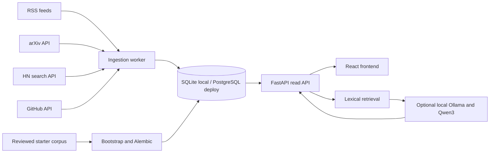

# AItlas architecture and implementation design

## Product boundary

AItlas connects five kinds of evidence: current developments, foundational knowledge, company activity, real implementations, and possible opportunities. The current build is a production-shaped V1, not a claim to cover the whole AI field. It is intentionally narrow in the historical archive and company library.

### Current user journeys

1. **Morning scan:** open the overview, read the indexed coverage summary, inspect news/papers/repos, filter the signal feed, and open original sources.
2. **Understand context:** open a signal's historical context panel, follow cited papers, and explore the timeline.
3. **Research a deployment:** inspect a company profile and the corresponding use case, including how the outcome was reported.
4. **Explore a possibility:** open an opportunity hypothesis, inspect its adjacent evidence and barriers, then conduct separate validation.
5. **Ask a question:** retrieve relevant indexed records; use extractive answers by default or optional local model synthesis with numbered citations.

### What V1 does not claim

No comprehensive company stack discovery, jobs feed, paper lineage graph, verified adoption scores, measured market size, 24-hour GitHub star velocity, personalized email digest, or statistically valid opportunity penetration metric is implemented. Those require additional data rights, identity, review and measurement work. They are not silently simulated in the UI.

## System diagram

The API never fetches arbitrary user-provided URLs. The worker uses fixed source endpoints and runs outside request processing. Nginx serves static frontend assets and proxies `/api` in the Compose setup.

## Technology choices

| Layer | Choice | Reason |
|---|---|---|
| Web | React 19, TypeScript, Vite, plain CSS, Lucide, self-hosted OFL fonts | Fast local iteration and static deployment; no proprietary runtime dependency |
| API | FastAPI, Pydantic, SQLAlchemy 2 | Typed contracts, API documentation, portable data access |
| Storage | SQLite on a laptop; PostgreSQL 17 in Compose | One-command local setup and a reliable concurrent production database |
| Migration | Alembic | Versioned schema changes; bootstrap applies the initial revision |
| Ingestion | Python worker, HTTPX, feedparser, OS trust store | Independent source failure handling and bounded HTTP calls |
| Optional LLM | Ollama with Apache-2.0 Qwen3-8B | Local inference with a permissively licensed model; no paid API requirement |
| Future hybrid search | PostgreSQL full-text plus pgvector | Prefer simple indexed retrieval until semantic search has demonstrated value |

Everything in the application runtime is open source. Public feeds and publisher APIs are external **data sources** whose content and API terms still apply. The model is optional. The frontend does not contact a font CDN at runtime.

## Data model and provenance

- `sources`: operator-configurable endpoint, adapter, options, enabled flag, poll interval, next due time, failure count, last successful sync, error and count.
- `items`: normalized URL, kind, title, short summary, source, publication/discovery time, tags and score.
- `knowledge`: curated historical milestone, year, topic, paper URL, and related IDs.
- `companies` and `evidence`: a profile plus individual cited claims. A profile without cited evidence should not be labeled as having an AI maturity tier.
- `use_cases`: deployment summary, reported outcome, domain, maturity label and evidence URL.
- `opportunities`: a clearly marked hypothesis, barrier and adjacent evidence URL.
- `job_runs`: ingestion status, errors and insertion count for operational review.

Every displayed current item has a source URL. Case-study outcomes are explicitly publisher-reported. `published_at` is source-provided; `discovered_at` is ingestion time. Time zones are converted to UTC on ingestion and formatted in the viewer's local time.

## Ingestion rules

1. Poll each enabled source when its own schedule is due, fetch a bounded number of entries with a 20-second request timeout, and retry transient errors once. A failed source gets exponential backoff and does not abort the others.
2. Clean markup, limit excerpt length and reject non-HTTP links. Remove common tracking parameters from canonical URLs.
3. Deduplicate by canonical URL and close title match within a three-day window. This avoids obvious syndicated duplicates; entity-level story clustering remains future work.
4. Apply simple relevance tags and a transparent heuristic score. Display recency separately. No hidden claim of editorial review or true trend velocity.
5. Commit each source independently; a repeated run is idempotent for existing canonical links.
6. Track refresh timestamps and show empty states instead of manufacturing content when sources fail.

Source APIs can throttle or change formats. A production operator should provide a GitHub token and monitor error trends. The worker stores each source's next poll time and backs off after failures. PostgreSQL advisory locking prevents two worker replicas from running the same cycle. At larger scale, a durable queue with per-source jobs and dead-letter handling should replace the single polling loop.

## Retrieval and answer safety

Current search is SQL filtering plus token-overlap ranking over curated records and the most recent 500 live items. This makes behavior easy to inspect and avoids downloading an embedding model just to search a small corpus. The answer endpoint returns explicit no-match results. Extractive mode reports the closest indexed snippets. If Ollama is configured, the prompt instructs the local model to use numbered snippets only, and the API accepts a generated answer only if its citation numbers refer to retrieved records. This **does not prove every generated claim is correct**; the UI asks readers to review linked sources.

At larger scale: add PostgreSQL `tsvector`/GIN for keyword retrieval, `pgvector` HNSW for semantic candidates, a cross-encoder reranker, and a claim-to-citation validation pass. Keep source snapshots and retrieval logs so answers can be audited. Do not import full papers or articles without appropriate rights.

## Security and reliability

- Public API is read-only except for `POST /ask`; ingestion and curation have no HTTP admin endpoint.
- Questions have length limits. Nginx applies per-client rate limiting to `/api/ask` in Compose. A larger or model-backed deployment needs shared rate limiting and an inference budget. Do not expose Ollama directly.
- Frontend renders text normally rather than injecting feed HTML. Source links use `noopener noreferrer`.
- Docker web port binds to `127.0.0.1`; Nginx re-resolves the API through Docker DNS after container replacement. Public hosting needs TLS at a reverse proxy, a fixed allowlist of origins, request limits and routine patching.
- Database credentials belong in environment or secret storage. Do not commit `.env` files. Use encrypted daily backups and a restore drill for PostgreSQL.
- Add structured metrics for source success, lag, duplicate rate, API latency and answer no-match rate. Alert on persistent source failure and stale data.
- Migrations run before API and worker start. Deploy migrations once, then roll application instances.

## Scale path

For the first thousands of records, one API, one worker and PostgreSQL are sufficient. Add indices on kind, publication date and source. At tens of thousands of items, move retrieval into database full-text indices and partition or archive old live items. At higher ingestion volume, split source adapters into queue jobs with per-source rate limits and dead-letter handling. Keep curated knowledge and evidence independent from volatile feed items.

## Next phases

1. **Depth:** choose one domain, import permitted primary papers, add entity resolution and reviewed links between concepts, papers, models and people.
2. **Accounts:** add OIDC, organization tenancy, consent, server-side saves/follows, account export/deletion, and per-user feed preferences.
3. **Search:** add hybrid retrieval only after an evaluation set of real questions shows a relevance improvement.
4. **Company and career intelligence:** add licensed or permitted company and job sources, observed timestamps, evidence freshness, and conflict resolution.
5. **Opportunity analysis:** build a workflow taxonomy, sourced denominator estimates and explicit confidence intervals; then validate with domain experts before ranking markets.
6. **Editorial quality:** add review tools, corrections, source takedown handling and automated regression evaluations for grounded answers.
